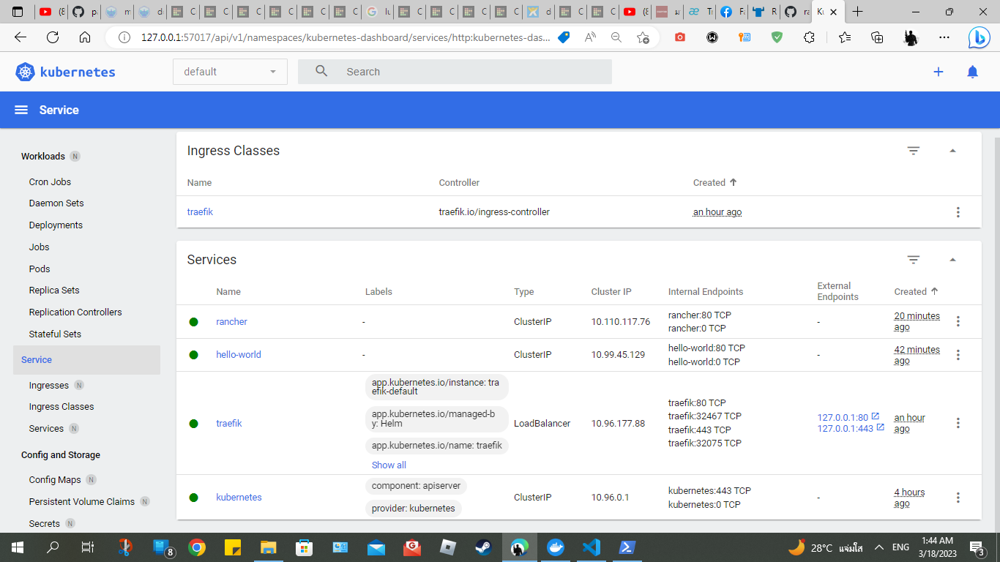

# MiniKube deploy Rancher Hello world website.


This tutorial will show you how to deploy rancher/hello-world website image by local Kubernetes A.K.A MiniKube
(tutorial นี่จะแสดงวิธีการ deploy ตัว rancher/hello-world เว็ปไซต์ image โดยใช้ local Kubernetes หรืออีกชื่อ MiniKube)

This workspace Wakatime : https://wakatime.com/@spcn27/projects/cjprodwpfe?start=2023-03-12&end=2023-03-18

|**Contents (สารบัญ)**|
| :-: |
| [Preparation (การเตรียมพร้อม)](#preparation) |
|[Step1: Create rancher deployment(ขั้นที่1: สร้าง rancher deployment)](#step1-create-rancher-deployment)|
|[Step2: Create ingress deployment(ขั้นที่2: สร้าง ingress deployment)](#step2-create-ingress-deployment)|
|[Step3: Deploy(ขั้นที่3: Deploy)](#step3-deploy)|
|[Result (ผลลัพธ์)](#result)|
|[Reference (อ้างอิง)](#reference)|

---

## Preparation 
(การเตรียมพร้อม) [top⬆️](#minikube-deploy-rancher-hello-world-website)

---

1. [Install Kubectl.](https://kubernetes.io/docs/tasks/tools/)  
   (ติดตั้ง kubectl)
2. [Minikube start](https://minikube.sigs.k8s.io/docs/start/) use **Docker** to be container manager because it's Cross platform    
   (เปิดใช้งาน minikube แนะนำให้ใช้ **Docker** เพื่อเป็นตัวจัดการ container เพราะมันเป็น Cross platform)

3. [Install Traefik on Kubernetes](https://github.com/iamapinan/kubeplay-traefik)   
 (ติดตั้ง traefik บน kubernetes)

4. Run command Connect to LoadBalancer services

         minikube tunnel

---
## Step1: Create rancher deployment
(ขั้นที่1: สร้าง rancher deployment) [top⬆️](#minikube-deploy-rancher-hello-world-website)

I create rancher deployment for deploy image of rancher hello world. this is my yml scripts.

<details><summary>Click me!!</summary>

   ```ruby
apiVersion: apps/v1
kind: Deployment
metadata:
  labels:
    app: hello-world
  name: hello-world
  namespace: default
spec:
  replicas: 1
  selector:
    matchLabels:
      app: hello-world
  strategy:
    rollingUpdate:
      maxSurge: 1
      maxUnavailable: 0
    type: RollingUpdate
  template:
    metadata:
      labels:
        app: hello-world
    spec:
      containers:
      - image: rancher/hello-world
        imagePullPolicy: Always
        name: hello-world
        ports:
        - containerPort: 80
          protocol: TCP
      restartPolicy: Always
---
apiVersion: v1
kind: Service
metadata:
  name: hello-world
  namespace: default
spec:
  ports:
  - port: 80
    protocol: TCP
    targetPort: 80
  selector:
    app: hello-world

   ```


</details>

from Scripts below they have 2 Group  Scripts by kind .

(จาก Scripts ที่เห็น พวกมันจะแบ่งเป็น 2 กลุ่ม Scripts โดย kind)
   -  *Deployment* contain command to pull image `rancher/hello-world`
      
      (*Deployment* จะมีคำสั่งในการ pull image `rancher/hello-world`)
   -  *Service*  contain command to create service and set port 80 for network   
     (*Service* จะมีคำสั่งในการสร้าง service และ ตั้ง port 80 สำหรับ network)

---
## Step2: Create ingress deployment
(ขั้นที่2: สร้าง ingress deployment) [top⬆️](#minikube-deploy-rancher-hello-world-website)

I create ingress deployment for deploy route by  ingress for create Reverse Proxy for Rancher service. this is my yml scripts.

(ผมสร้าง ingress deployment เพื่อ deploy route โดย ingress สำหรับทำ Reverse Proxy เพื่อ Rancher service นี่คือ yml scripts ของผม)

<details><summary>Click me!!</summary>

   ```ruby
apiVersion: traefik.containo.us/v1alpha1
kind: IngressRoute
metadata:
  name: traefik-ingress
  namespace: default
spec:
  entryPoints:
    - web
    - websecure
  routes:
  - match: Host(`web.spcn27.local`) # You can change Domain name (คุณสามารถเปลี่ยนชื่อ Domain ได้)
    kind: Rule
    services:
    - name: hello-world
      namespace: default
      port: 80 
   ```

</details>


from Scripts below it's contain command to create route by tag `kind` and create Reverse Proxy by tag `spec` in side they Declare  `routes` for set Domain name and get service name hello-world from rancher-deployment.yml file

(จาก Scripts ที่เห็นมันมีคำสั่งสร้าง route โดย `kind` และสร้าง Reverse Proxy โดย `spec` ภายในพวกมันจะประกาศ `routes` เพื่อตั้งชื่อ Domain และ ดึง service ชื่อ hello-world จาก rancher-deployment.yml)

---
## Step3: Deploy
 (ขั้นที่3: Deploy) [top⬆️](#minikube-deploy-rancher-hello-world-website)

-  Deploy rancher-deployment.yml file  command 

   (คำสั่ง Deploy ของ rancher-deployment.yml ไฟล์)
   ```
         kubectl apply -f rancher-deployment.yaml

   ```

-  Deploy ingress-deployment.yml file  command 

   (คำสั่ง Deploy ของ ingress-deployment.yml ไฟล์)
   ```
         kubectl apply -f ingress-deployment.yaml

   ```

After All you need to set Domain name that you set in `ingress-deployment.yaml` file into Host file by open your **Terminal Shell As administrator** do this tutorial 

(หลังจากนั้นคุณต้องตั้ง Domain name ที่คุณตั้งใน `ingress-deployment.yaml` ไฟล์ ลงใน Host ไฟล์ โดยการเข้า  **Terminal Shell As administrator** และทำตามขั้นตอนนี้)
 https://www.siteground.com/kb/hosts-file/

This is my setting 


---
 ## Result 
(ผลลัพธ์) [top⬆️](#minikube-deploy-rancher-hello-world-website)

After Deploy First I will show you my Kubernetes Dashboard (You must do in  [preparation](#preparation) to access) You will see Service Appear *rancher* and *hello-world*  
(หลังจาก Deploy อย่างแรก ผมจะแสดง หน้า Kubernetes Dashboard ( คุณควรทำ [preparation](#preparation) ก่อนจึงจะเข้าได้) คุณจะเห็นว่า Service แสดงเพิ่มขึ้นมามี *rancher* และ *hello-world*)

URL: http://127.0.0.1:57017/api/v1/namespaces/kubernetes-dashboard/services/http:kubernetes-dashboard:/proxy/#/workloads?namespace=default





Now I will show my traefik Dashboard in *HTTPS Routers* You will see the `Host(`web.spcn27.local`)`command of Scripts yml that I set in ingress-deployment.yaml file appear

(ตอนนี้ ผมจะ แสดง traefik Dashboard ของผมซึ่งใน *HTTPS Routers* จะเห็นว่า `Host(`web.spcn27.local`)`คำสั่ง ของ Scripts yml ที่ผมตั้งไว้ใน ingress-deployment.yaml ไฟล์แสดงขึ้นมา)

URL: https://traefik.spcn27.local/dashboard/#/


And Now I can Show you web result You will see in *Show request details* button it would show request your domain and pod name from your deploy yml file

(ตอนนี้ผมก็สามารถแสดงหน้าเว็ปได้แล้ว คุณจะเห็นในปุ่ม *Show request details* มันควรจะแสดงการ request domain และ pod name จาก deploy yml ไฟล์ของคุณ)

URL: http://web.spcn27.local/rancher


---

***Thank you For visit my tutorial. Hope it will help you and Sorry for my poor English*** 

***(ขอบคุณสำหรับการเยี่ยมชม tutorial ของผลหวังว่ามันจะช่วยคุณ และ ขออภัยสำหรับความอ่อนของ ภาษาอังกฤษของผลครับ)***

-----
### Reference 
(อ้างอิง) [top⬆️](#minikube-deploy-rancher-hello-world-website)

Traefik install repo : https://github.com/iamapinan/kubeplay-traefik

Host file setting tutorial : https://www.siteground.com/kb/hosts-file/

---

   